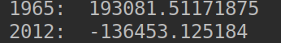
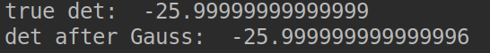
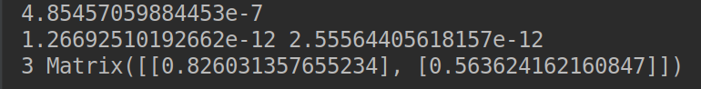

# 计算方法实验报告
#### 项目地址：https://github.com/CM-BF/ComputingMethod

##### PB16060674-归舒睿

[TOC]

## 实验环境

Ubuntu 18.04
python 3.7

## 第一题

### 题目：程序 3

数据同上表，用Newton插值估计：
（1） 1965年的人口数；
（2） 2012年的人口数。

数据：

|　年份　| 人口　|
|-------|------|
| 1920 | 105711 |
| 1930 | 123203 |
| 1940 | 131669 |
| 1950 | 150697 |
| 1960 | 179323 |
| 1970 | 203212 |

### 程序分析

* 库：numpy
* 读取数据方式：./data/NewtonInsert.txt
* 读取数据
* 根据公式制作差商表
* 根据Newton插值公式定义Newton函数
* 预测1965和2012年的人口数

### 结果分析



output:
> 1965:  193081.51171875 
> 2012:  -136453.125184

由此看出，对于牛顿差值法，在控制点之间的预测是相对准确的，而超出这个范围，则完全没有参考价值。

### 代码

```python
'''
Describe: 程序 3 （1）（2）
Date: 09 Apr 2019
Author: 归舒睿
'''


import numpy as np
inputfile = open("data/NewtonInsert.txt", "r")
line = inputfile.readline()
data = []
count = 0
while line != '':
    count += 1
    line = line.strip('\n').split(' ')
    data.append({'x': int(line[0]), 'y':int(line[1])})
    line = inputfile.readline()

g = np.zeros((count, count), np.float)

for j in range(count):
    for i in range(j, count):
        if j == 0:
            g[i][j] = data[i]['y']
        else:
            g[i][j] = (g[i][j-1] - g[i-1][j-1]) / (data[i]['x'] - data[i-j]['x'])


predict = [1965, 2012]

def Newton(x):
    global count
    N = 0
    t = 1
    for k in range(count):
        N += g[k][k] * t
        t *= x - data[k]['x']
    return N

print('1965: ', Newton(predict[0]), '\n2012: ', Newton(predict[1]))

```

## 第二题

### 题目：程序 11

用Gauss消元法计算A的行列式。
输入：行列式的阶数n，行列式A的元素
输出：A的行列式的值

### 代码分析

* 输入数据：  
  3  
  -1 3 2  
  2 1 -2  
  3 6 2  
$$
\left[
\begin{matrix}
    -1 & 3 & 2 \\
    2 & 1 & -2 \\
    3 & 6 & 2
\end{matrix}
\right]
\tag{1}
$$

* 通过文件读取数据
* 使用挑选最大主元的的Gauss消元法
* 通过消元后的行列式的对角线的相乘计算行列式的值

### 结果分析



> true det:  -25.99999999999999
> det after Gauss:  -25.999999999999996

上面的是直接调用函数运算的det值，后者是消元后计算的det值。

### 代码

```python
import numpy as np
import copy

inputfile = open("data/Gauss.txt", "r")
n = int(inputfile.readline().strip("\n"))
A = np.zeros((n, n), np.float)

for i in range(n):
    line = inputfile.readline().strip("\n").split(' ')
    line = [int(x) for x in line]
    A[i] = line

print('true det: ', np.linalg.det(A))


for i in range(n):
    k = i
    for j in range(i+1, n):
        if abs(A[k][i]) < abs(A[j][i]):
            k = j

    # exchange
    t = copy.deepcopy(A[k])
    A[k] = copy.deepcopy(A[i])
    A[i] = t

    for j in range(i+1, n):
        A[j][i] = A[j][i]/A[i][i]
        A[j][i+1:n] = A[j][i+1:n] - A[j][i] * A[i][i+1:n]
        A[j][i] = 0

det = 1
for i in range(n):
    det *= A[i][i]
print('det after Gauss: ', det)

```

## 第三题

### 题目： 程序10

用Newton迭代法求解非线性方程组：

$$
\left\{
    \begin{array}{lr}
        f(x)=x^2+y^2-1=0 & \\
        g(x)=x^3-y=0
    \end{array}
\right.
$$

取
$$
\left(
	\begin{array}{lr}
		x_0 \\ y_0
	\end{array}
\right)
=
\left(
	\begin{array}{lr}
		0.8 \\ 0.6
	\end{array}
\right)
$$
, 误差控制
$$
max(|x_k|, |y_k|) <= 10^-5 
$$
.

### 代码分析

输入为x0和y0

* 使用库: sympy，用于对符号的求导，因为需要求方程组的雅可比矩阵
* 首先定义符号x,y
* 然后定义符号函数f,g
* 把两个函数合成方程组矩阵
* 求其雅可比矩阵
* 构造起始向量X，内容为x0和y0
* 使用公式迭代，并且和e比较，达到精度时停止

### 结果分析



> 1.26692510192662e-12 2.55564405618157e-12  
> 3 Matrix([[0.826031357655234], [0.563624162160847]])

* 第一行为迭代完成时f,和g的大小，可以看到都很接近于零。
* 第二行第一个数为迭代次数
* 之后为结果向量，即解
$$
\left(
    \begin{array}{lr}
        0.826031357655234 \\  
        0.563624162160847          
    \end{array}
\right)
$$

### 代码

```python
from sympy import *

x = symbols("x")
y = symbols("y")

f = x**2 + y**2 -1
g = x**3 - y
F = Matrix([[f], [g]])
e = 10**-5
X = [Matrix([[0.8], [0.6]])]

J = Matrix([[diff(f, x), diff(f, y)], [diff(g, x), diff(g, y)]])

k = 0
X.append(X[k] - J.evalf(subs={x:X[k][0], y:X[k][1]})**(-1) * F.evalf(subs={x:X[k][0], y:X[k][1]}))
k += 1
while abs(max(X[k][0] - X[k-1][0], X[k][1] - X[k-1][1])) >= e:
    X.append(X[k] - J.evalf(subs={x: X[k][0], y: X[k][1]}) ** (-1) * F.evalf(subs={x: X[k][0], y: X[k][1]}))
    k += 1


print(max(X[k][0] - X[k-1][0], X[k][1] - X[k-1][1]))
print(f.evalf(subs={x:X[k][0], y:X[k][1]}), g.evalf(subs={x:X[k][0], y:X[k][1]}))
print(k, X[k])
```
